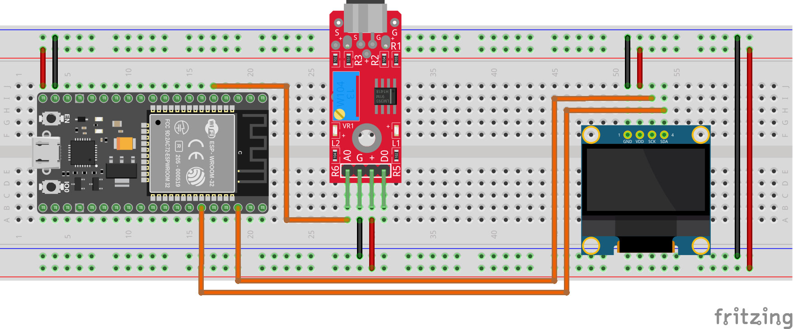

# spectrum-analyzer


## demo


## mini docs

The project requires the following components:

- ESP32 DevKit V1
- OLED Display 128x64
- KY-037 Microphone with LM393 Comparator

The following is the schematic of the project:

<p align="center">
    
</p>

> [!NOTE]
> You can find the Fritzing project file in the `.github/fritzing/` directory.

## Download & Usage

If you want to use the project, you need to clone the repository with the following command:

```
git clone https://github.com/AntonioBerna/spectrum-analyzer.git
```

> [!WARNING]
> You need to have the [PlatformIO](https://platformio.org/install/ide?install=vscode) extension installed on your Visual Studio Code.
